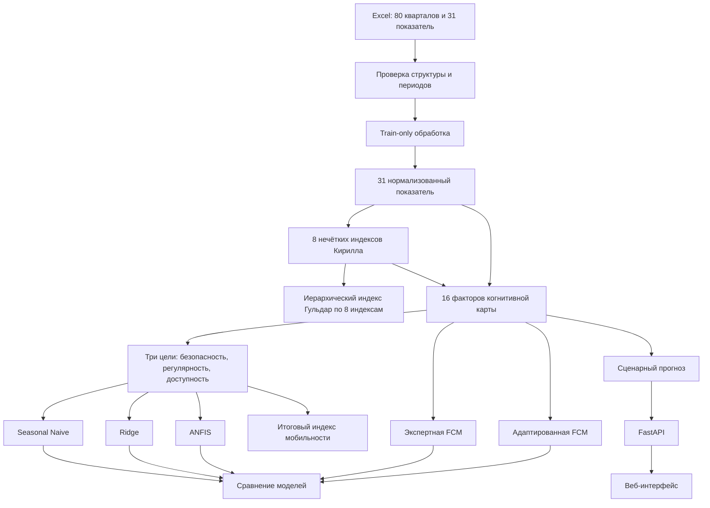

# Как устроен нейросимулятор Смоленска

Это подробное объяснение проекта простыми словами. Документ рассчитан на человека, который раньше не работал с машинным обучением, нечёткой логикой, когнитивными картами или API.

Если нужна только короткая инструкция по запуску, смотрите [README.md](README.md). Здесь объясняется не только **как запустить**, но и **зачем нужен каждый модуль, откуда берутся числа и как данные проходят через всю систему**.

## Содержание

1. [Что делает проект](#1-что-делает-проект)
2. [Главная идея на простом примере](#2-главная-идея-на-простом-примере)
3. [Полная схема движения данных](#3-полная-схема-движения-данных)
4. [Из каких файлов состоит проект](#4-из-каких-файлов-состоит-проект)
5. [Как устроен исходный Excel](#5-как-устроен-исходный-excel)
6. [Почему данные делятся на train, validation и test](#6-почему-данные-делятся-на-train-validation-и-test)
7. [Как выполняется подготовка данных](#7-как-выполняется-подготовка-данных)
8. [Что такое восемь нечётких индексов](#8-что-такое-восемь-нечётких-индексов)
9. [Иерархический экспертный индекс Гульдар](#9-иерархический-экспертный-индекс-гульдар)
10. [Как получаются три основные цели](#10-как-получаются-три-основные-цели)
11. [Что такое итоговый индекс мобильности](#11-что-такое-итоговый-индекс-мобильности)
12. [Как устроена нечёткая когнитивная карта](#12-как-устроена-нечёткая-когнитивная-карта)
13. [Как экспертные связи уточняются по данным и ANFIS](#13-как-экспертные-связи-уточняются-по-данным-и-anfis)
14. [Какие модели сравниваются](#14-какие-модели-сравниваются)
15. [Как оценивается качество моделей](#15-как-оценивается-качество-моделей)
16. [Как работают сценарии](#16-как-работают-сценарии)
17. [Формат пользовательского JSON-сценария](#17-формат-пользовательского-json-сценария)
18. [Как устроен API](#18-как-устроен-api)
19. [Как устроен интерфейс](#19-как-устроен-интерфейс)
20. [Что показывает чувствительность](#20-что-показывает-чувствительность)
21. [Что происходит при запуске приложения](#21-что-происходит-при-запуске-приложения)
22. [Как запустить проект](#22-как-запустить-проект)
23. [Как запустить тесты](#23-как-запустить-тесты)
24. [Чем реальная архитектура отличается от старого файла архитектуры](#24-чем-реальная-архитектура-отличается-от-старого-файла-архитектуры)
25. [Ограничения проекта](#25-ограничения-проекта)
26. [Словарь терминов](#26-словарь-терминов)
27. [Полный пример одного расчёта](#27-полный-пример-одного-расчёта)

## 1. Что делает проект

Проект посвящён **проблеме Б — транспортной доступности и безопасности городской мобильности Смоленска**.

Приложение отвечает на несколько вопросов:

- насколько безопасно движение в городе;
- насколько регулярно ходит общественный транспорт;
- насколько транспортная система доступна для жителей;
- как изменится ситуация, если увеличить или уменьшить бюджет, ремонт дорог, количество переходов и другие управляемые факторы;
- какие факторы сильнее всего меняют результат;
- какая модель лучше предсказывает известные исторические данные.

Проект не является системой управления реальным городом. Это **аналитический прототип**: он помогает изучать причинные предположения и сравнивать сценарии.

Основные результаты имеют шкалу от `0` до `100`:

- `0` — очень плохое состояние;
- `100` — очень хорошее состояние.

Исключение — некоторые показатели в исходных единицах, например ДТП на 10 тысяч жителей, километры ремонта и доля рейсов по расписанию.

## 2. Главная идея на простом примере

Представим, что город — это большая машина.

- Бюджет — это топливо.
- Ремонт дорог — это работа механика.
- Состояние дорог — это исправность деталей.
- Загруженность — это сопротивление движению.
- Регулярность транспорта — это точность работы механизма.
- Безопасность и доступность — это итог, который чувствуют жители.

Мы знаем историю этой «машины» за 80 кварталов. Приложение:

1. читает исторические данные;
2. приводит разные единицы измерения к общей шкале;
3. строит понятные экспертные индексы;
4. создаёт карту причинных связей;
5. сравнивает несколько способов прогнозирования;
6. позволяет изменить управляющие факторы;
7. пересчитывает будущее состояние системы.

Например, пользователь может задать:

```text
исполнение бюджета транспорта: +0,15
загруженность:                  -0,10
горизонт:                        8 кварталов
```

После этого приложение показывает, как относительно инерционного прогноза изменятся регулярность, безопасность, доступность и общий индекс мобильности.

## 3. Полная схема движения данных



Короткая текстовая версия:

```text
новый Excel
    → проверка
    → обработка без утечки будущего
    → 8 нечётких индексов
    → иерархический baseline Гульдар
    → 16 факторов FCM
    → 3 целевых ряда
    → 5 сравниваемых моделей
    → сценарный прогноз
    → итоговый индекс
    → API и интерфейс
```

## 4. Из каких файлов состоит проект

```text
neuro_simulator_smolensk/
├─ README.md                         краткая документация
├─ описание.md                       этот подробный документ
├─ LOCAL_SETUP.md                    локальный запуск
├─ requirements.txt                 зависимости Python
├─ setup_local.ps1                  создание окружения и установка пакетов
├─ run_local.ps1                    запуск сервера
├─ datasets_ready/
│  └─ smolensk_dataset_shared.xlsx  рабочий датасет
├─ app/
│  ├─ config.py                     пути, временные границы и параметры FCM
│  ├─ data.py                       Excel, обработка, факторы и цели
│  ├─ fuzzy.py                      нечёткая логика и 2164 правила
│  ├─ hierarchical_index.py         свёртка 8 нечётких индексов Гульдар
│  ├─ models.py                     Ridge, ANFIS и метрики
│  ├─ fcm.py                        когнитивная карта и сценарный расчёт
│  ├─ scenarios.py                  проверка и хранение JSON-сценариев
│  ├─ service.py                    объединение данных и моделей
│  ├─ main.py                       FastAPI и HTTP-маршруты
│  └─ static/
│     ├─ index.html                 структура страницы
│     ├─ styles.css                 оформление
│     ├─ app.js                     загрузка API и построение графиков
│     └─ vendor/                    локальные Plotly и Cytoscape
├─ runtime/                         локальные данные, не отправляются в Git
│  ├─ models/                       проверенные .npz-артефакты ANFIS
│  └─ scenarios/                    только импорт JSON из старой версии
└─ tests/
   ├─ test_data.py                  тесты данных
   ├─ test_fuzzy_hierarchical.py    тесты нечётких и иерархического индексов
   ├─ test_models.py                тесты моделей и FCM
   ├─ test_api.py                   тесты HTTP API
   ├─ test_scenarios.py             тесты сохранения сценариев
   └─ test_validation_extra.py      граничные проверки
```

Папки `colab/` и `Document/` используются как источники идей и документов, но приложение не импортирует из них код во время работы. Это важно: сервер должен запускаться только из версионируемых модулей `app/`.

Папка `runtime/` не отправляется в Git. `runtime/models/` содержит локальный кэш ANFIS, а `runtime/scenarios/` нужен только для однократного импорта JSON из старой файловой версии; рабочие пользовательские сценарии хранятся в PostgreSQL.

## 5. Как устроен исходный Excel

Рабочий файл:

```text
datasets_ready/smolensk_dataset_shared.xlsx
```

Используется лист `Лист1`.

В таблице:

- 80 строк — кварталы от `2006Q1` до `2025Q4`;
- 5 служебных столбцов;
- 31 числовой показатель;
- 1 пустой столбец «Целевой показатель»;
- две строки заголовка.

Пять служебных столбцов:

| Столбец | Значение |
|---|---|
| `period` | квартал вида `2025Q4` |
| `period_start` | дата начала квартала |
| `year` | год |
| `quarter` | номер квартала от 1 до 4 |
| `period_index` | последовательный номер периода |

31 показатель распределён по шести тематическим блокам:

| Блок Excel | Число показателей | Примеры |
|---|---:|---|
| Современная городская среда | 3 | бюджет, дворы, удовлетворённость |
| Дорожно-транспортный комплекс | 9 | дороги, рейсы, скорость, ДТП, переходы |
| Доступная среда | 3 | бюджет, мероприятия, получатели поддержки |
| Общественные пространства | 3 | бюджет, территории, удовлетворённость |
| Городской общественный транспорт | 9 | дороги, пассажиропоток, рейсы, скорость, ДТП |
| Парковки и безопасность движения | 4 | бюджет, ремонт, состояние, дефекты |

Проверка суммы:

```text
3 + 9 + 3 + 3 + 9 + 4 = 31 показатель
```

Пустой столбец «Целевой показатель» не используется как готовый ответ. Цели рассчитываются воспроизводимыми формулами внутри проекта.

## 6. Почему данные делятся на train, validation и test

Временной ряд нельзя случайно перемешивать. Будущее не должно помогать модели объяснять прошлое.

Используются три последовательных отрезка:

| Часть | Период | Кварталов | Для чего нужна |
|---|---|---:|---|
| Train | `2006Q1–2018Q4` | 52 | обучение нормализации и моделей |
| Validation | `2019Q1–2022Q4` | 16 | выбор параметров ANFIS и промежуточная оценка |
| Test | `2023Q1–2025Q4` | 12 | финальная честная проверка |

### Простая аналогия

Ученик готовится к контрольной:

- train — учебник и упражнения;
- validation — пробная контрольная;
- test — настоящая контрольная.

Если заранее показать ученику ответы настоящей контрольной, оценка будет нечестной. В анализе данных это называется **утечкой данных**.

Поэтому по test не вычисляются:

- минимум и максимум нормализации;
- границы выбросов;
- параметры логарифмирования;
- коэффициенты Ridge;
- центры и ширины ANFIS;
- корреляционные поправки FCM.

## 7. Как выполняется подготовка данных

Подготовка находится в `app/data.py`.

### Шаг 1. Проверка файла

Приложение проверяет:

- существует ли Excel;
- есть ли лист `Лист1`;
- имеет ли таблица размер `80 × 37`;
- идут ли кварталы строго от `2006Q1` до `2025Q4`;
- совпадают ли пять служебных столбцов;
- есть ли ровно 31 числовой показатель;
- нет ли `NaN`, бесконечности и нечисловых значений.

Если проверка не проходит, приложение останавливается с понятной ошибкой. Оно не пытается молча угадать структуру неверного файла.

### Шаг 2. Уникальные программные имена

В разных блоках встречаются одинаковые подписи, например «Исполнение бюджета, %» или «ДТП на 10 тыс. жителей».

Для программы они разделяются:

- дорожный комплекс получает суффикс `_A`;
- общественный транспорт — `_B`;
- парковки и безопасность — `_C`.

Поэтому ДТП дорожного комплекса и ДТП общественного транспорта не смешиваются случайно.

### Шаг 3. Направление показателя

У признаков бывает положительное и отрицательное направление.

Положительный показатель:

```text
больше → лучше
```

Примеры: нормативное состояние дорог, регулярность рейсов, средняя скорость.

Отрицательный показатель:

```text
меньше → лучше
```

Примеры: ДТП и срок устранения дефектов.

После нормализации отрицательные признаки разворачиваются:

```text
качество = 1 - нормализованное плохое значение
```

Теперь для всех внутренних факторов действует одно правило: больше означает лучше, кроме специально обозначенной загруженности.

### Шаг 4. Логарифмирование асимметричных признаков

Некоторые показатели имеют редкие очень большие значения. Для них применяется `log1p`, то есть `log(1 + x)`.

Это используется для:

- количества благоустроенных дворов;
- пассажиропотока двух транспортных блоков;
- ДТП блока общественного транспорта;
- регулируемых переходов блока общественного транспорта;
- количества завершённых мероприятий.

Логарифм не удаляет наблюдение. Он уменьшает чрезмерное влияние очень большого числа.

### Шаг 5. Границы выбросов

Строки с выбросами не удаляются, потому что каждый квартал важен для временного ряда.

На train вычисляется межквартильный размах:

```text
IQR = Q3 - Q1
нижняя граница = Q1 - 1,5 × IQR
верхняя граница = Q3 + 1,5 × IQR
```

Значения за границами прижимаются к границе. Это называется winsorization.

### Шаг 6. Min-max-нормализация

Разные показатели имеют разные единицы: проценты, километры, человек, поездки, сутки.

Чтобы их сравнивать, они переводятся в диапазон от `0` до `1`:

```text
scaled = (x - train_min) / (train_max - train_min)
```

Затем для отображения некоторые значения умножаются на `100`.

Минимум и максимум всегда берутся только из train. Значения validation и test преобразуются готовыми train-параметрами и ограничиваются диапазоном `[0, 1]`.

## 8. Что такое восемь нечётких индексов

В Excel шесть тематических блоков, но нечётких индексов восемь. Это не ошибка.

Два больших транспортных блока по 9 показателей делятся каждый на два смысловых индекса:

```text
6 блоков Excel
    + дополнительное деление дорожного комплекса на 2 части
    + дополнительное деление общественного транспорта на 2 части
    = 8 нечётких индексов
```

| № | Нечёткий индекс | Входов |
|---:|---|---:|
| 1 | Качество современной городской среды | 3 |
| 2 | Качество дорог дорожного комплекса | 6 |
| 3 | Благополучие дорог дорожного комплекса | 3 |
| 4 | Удовлетворённость доступной средой | 3 |
| 5 | Качество общественных пространств | 3 |
| 6 | Качество дорог общественного транспорта | 6 |
| 7 | Благополучие дорог общественного транспорта | 3 |
| 8 | Качество парковок и безопасности движения | 4 |

### Что означает «нечёткий»

Обычное жёсткое правило выглядит так:

```text
скорость 40 км/ч — низкая
скорость 41 км/ч — средняя
```

Получается резкий скачок из-за одного километра в час.

Нечёткая логика позволяет одному значению частично принадлежать нескольким словам:

```text
скорость 40 км/ч:
низкая  = 0,55
средняя = 0,45
```

То есть система говорит не «только низкая», а «скорее низкая, но немного средняя».

### Этапы нечёткого расчёта

1. **Фаззификация.** Число превращается в степени принадлежности словам.
2. **Активация правил.** Для условия «A И B» берётся минимум.
3. **Агрегация.** Результаты правил объединяются максимумом.
4. **Дефаззификация.** Нечёткая фигура превращается обратно в число методом центра тяжести.

Упрощённое правило:

```text
ЕСЛИ состояние дорог высокое
И устранение дефектов быстрое,
ТО качество дорог высокое.
```

Используются треугольные `trimf` и трапециевидные `trapmf` функции принадлежности.

Всего перенесено 2164 правила:

```text
125 × 3 системы
+ 729 × 2 системы
+ 125 × 2 системы
+ 81 × 1 система
= 2164 правила
```

Границы функций принадлежности формируются на основе train-нормализации, поэтому test не помогает настраивать нечёткую систему.

## 9. Иерархический экспертный индекс Гульдар

Экспертный индекс — это понятная взвешенная сумма. Эксперт заранее говорит, какие показатели важнее.

Этот индекс является **baseline**, то есть контрольным ориентиром. Он не заменяет три основные цели.

### 9.1. Свёртка восьми нечётких индексов

Второй notebook Гульдар агрегирует не 31 сырое значение, а восемь уже готовых нечётких индексов.

```text
31 показатель
    → 8 нечётких индексов
    → 1 иерархический экспертный индекс
```

Экспертные веса:

| Индекс | Исходный вес | Доля после нормирования |
|---|---:|---:|
| Современная городская среда | 0,6 | 13,04% |
| Качество дорог дорожного комплекса | 0,6 | 13,04% |
| Благополучие дорог дорожного комплекса | 0,7 | 15,22% |
| Доступная среда | 0,2 | 4,35% |
| Общественные пространства | 0,5 | 10,87% |
| Качество дорог общественного транспорта | 0,7 | 15,22% |
| Благополучие дорог общественного транспорта | 0,9 | 19,57% |
| Парковки и безопасность | 0,4 | 8,70% |

Сумма исходных весов равна `4,6`. Перед использованием каждый вес делится на `4,6`.

Нормализация восьми входов также обучается только на train. В интерфейсе показываются:

- последнее значение;
- минимум и максимум;
- среднее и медиана;
- стандартное отклонение;
- вклад каждого из восьми индексов.

### Почему нужны оба индекса

Первый отвечает на вопрос:

> Какие конкретные исходные показатели формируют экспертную оценку?

Второй отвечает на вопрос:

> Какие крупные смысловые направления формируют экспертную оценку?

Это два уровня объяснения одной системы.

## 10. Как получаются три основные цели

В проекте три основных целевых ряда.

### 10.1. Безопасность движения

Сначала усредняются показатели ДТП из двух транспортных блоков:

```text
ДТП_среднее = (ДТП_дорожный_комплекс + ДТП_общественный_транспорт) / 2
```

Затем показатель нормализуется с отрицательным направлением:

```text
безопасность = 1 - normalized(ДТП_среднее)
```

Результат умножается на `100`.

Поэтому:

- больше ДТП → меньше индекс безопасности;
- меньше ДТП → больше индекс безопасности.

API также возвращает расчётное ДТП в исходных единицах, чтобы пользователь видел не только абстрактный балл.

### 10.2. Регулярность транспорта

Берётся среднее двух показателей рейсов по расписанию:

```text
регулярность =
    (рейсы_по_расписанию_A + рейсы_по_расписанию_B) / 2
```

В истории регулярность показывается в процентах. Для FCM она дополнительно переводится в диапазон `[0, 1]` по train.

### 10.3. Транспортная доступность

Доступность состоит из пяти частей:

```text
доступность =
    0,30 × регулярность
  + 0,20 × средняя скорость
  + 0,20 × нормативное состояние дорог
  + 0,15 × регулируемые переходы
  + 0,15 × нечёткая транспортная среда
```

Нечёткая транспортная среда — среднее четырёх индексов:

- современная городская среда;
- доступная среда;
- общественные пространства;
- парковки и безопасность.

Все части перед сложением находятся в диапазоне `[0, 1]`.

## 11. Что такое итоговый индекс мобильности

Итоговый индекс не обучается как отдельная независимая модель. Он всегда собирается из трёх согласованных частей:

```text
итоговая мобильность =
    100 × (безопасность + регулярность_norm + доступность) / 3
```

Это важное правило.

Если бы итог прогнозировался отдельной моделью, могла бы возникнуть странная ситуация:

```text
безопасность ухудшилась
регулярность ухудшилась
доступность ухудшилась
но отдельная модель итогового индекса показала рост
```

Текущая формула исключает такое логическое противоречие.

## 12. Как устроена нечёткая когнитивная карта

FCM расшифровывается как **Fuzzy Cognitive Map**, или нечёткая когнитивная карта.

Это ориентированный граф:

- узел — показатель;
- стрелка — причинное влияние;
- вес стрелки — сила и направление влияния.

Положительная связь:

```text
источник растёт → цель стремится расти
```

Отрицательная связь:

```text
источник растёт → цель стремится снижаться
```

### 16 узлов карты

| № | Узел | Роль |
|---:|---|---|
| 1 | Исполнение дорожного бюджета | управляющий |
| 2 | Исполнение бюджета транспорта | управляющий |
| 3 | Исполнение бюджета безопасности | управляющий |
| 4 | Ремонт дорог | управляющий |
| 5 | Нормативное состояние дорог | промежуточный |
| 6 | Эффективность устранения дефектов | промежуточный |
| 7 | Пассажиропоток | внешний |
| 8 | Регулярность транспорта | цель |
| 9 | Средняя скорость | промежуточный |
| 10 | Регулируемые переходы | управляющий |
| 11 | Нечёткое качество дорог | промежуточный |
| 12 | Нечёткое благополучие дорог | промежуточный |
| 13 | Нечёткая транспортная среда | промежуточный |
| 14 | Загруженность | внешний |
| 15 | Безопасность движения | цель |
| 16 | Транспортная доступность | цель |

Карта содержит 34 экспертные связи.

Примеры:

```text
дорожный бюджет        → ремонт дорог             +0,75
ремонт дорог           → состояние дорог          +0,65
состояние дорог        → безопасность             +0,55
пассажиропоток         → загруженность            +0,45
загруженность          → регулярность             -0,45
загруженность          → доступность              -0,60
регулируемые переходы  → безопасность             +0,55
регулярность           → доступность              +0,65
```

### Один шаг FCM

Все 16 текущих значений складываются в вектор состояния.

Упрощённая формула:

```text
активация = sigmoid(состояние × матрица_весов + внешний_импульс)

новое_состояние =
    (1 - alpha) × старое_состояние
  + alpha × активация
```

Используются:

- инерция `alpha = 0,35`;
- крутизна sigmoid `lambda = 1,3`;
- ограничение результата диапазоном `[0, 1]`.

Инерция означает, что система не прыгает мгновенно в новое состояние. Только 35% нового расчётного сигнала попадает в следующий квартал.

## 13. Как экспертные связи уточняются по данным и ANFIS

Есть две версии FCM.

### Экспертная FCM

Использует только 34 заранее заданных экспертных веса.

### Адаптированная FCM

Сочетает эксперта, исторические данные и локальные эффекты ANFIS.

Для каждой экспертной связи проверяется лаговая зависимость:

```text
source(t) → target(t + 1)
```

Например, сравнивается дорожный бюджет текущего квартала с ремонтом следующего квартала.

Корреляция вычисляется только на train. Берётся сила корреляции, а знак сохраняется из экспертной связи.

Для связей, ведущих к целевым узлам, могут использоваться локальные эффекты ANFIS: модель немного увеличивает вход, немного уменьшает его и оценивает изменение выхода.

Итоговый вес:

```text
адаптированный вес = 0,70 × экспертный + 0,30 × вес по данным
```

Дополнительные правила:

- знак эксперта не меняется;
- вес ограничивается диапазоном `[-1, 1]`;
- несуществующие экспертные связи автоматически не добавляются.

То есть данные могут уточнить силу связи, но не могут незаметно перевернуть заложенную причинную логику.

## 14. Какие модели сравниваются

Для каждой из трёх целей сравниваются пять моделей.

### 14.1. Seasonal Naive

Самый простой сезонный прогноз:

```text
прогноз следующего квартала = значение четыре квартала назад
```

Например, прогноз для `2025Q2` равен факту `2024Q2`.

Эта модель нужна как честная простая точка сравнения. Сложная модель должна быть полезнее простого повторения прошлого года.

### 14.2. Ridge по четырём лагам

Ridge получает четыре предыдущих значения:

```text
y(t-1), y(t-2), y(t-3), y(t-4)
```

И строит линейную зависимость. Регуляризация не даёт коэффициентам становиться чрезмерно большими.

### 14.3. Экспертная FCM

Использует только экспертную матрицу причинных связей.

### 14.4. Адаптированная FCM

Использует смешанную матрицу `70% эксперт + 30% данные`.

### 14.5. ANFIS

ANFIS объединяет нечёткие правила и регрессию Сугено.

В новых ячейках Colab Кирилла модель оформлена отдельным классом `ANFIS`, а веса и нормализаторы сохраняются отдельно от кода и затем загружаются для прогноза. В приложении этот подход перенесён в `app/models.py`: класс `ANFIS` отвечает за обучение, прогноз, сохранение и загрузку, а `ProblemBService` управляет тремя целевыми экземплярами.

Для каждого входа создаются две гауссовы функции принадлежности. При четырёх входах получается:

```text
2 × 2 × 2 × 2 = 16 правил
```

Линейные части правил обучаются Ridge-методом.

ANFIS перебирает:

- ширину функций `sigma`: `0,20`, `0,35`, `0,50`;
- Ridge-регуляризацию: `0,001`, `0,01`, `0,1`.

Выбирается комбинация с лучшим RMSE на validation.

Входы ANFIS для безопасности:

- состояние дорог;
- эффективность устранения дефектов;
- регулируемые переходы;
- загруженность.

Для регулярности:

- бюджет транспорта;
- пассажиропоток;
- загруженность;
- нечёткое благополучие дорог.

Для доступности:

- состояние дорог;
- регулярность;
- загруженность;
- нечёткая транспортная среда.

### 14.6. Сохранение и загрузка ANFIS

Каждая целевая модель сохраняется отдельно:

```text
runtime/models/
├─ anfis_traffic_safety.npz
├─ anfis_transport_regularity.npz
└─ anfis_transport_accessibility.npz
```

Артефакт содержит только числовые массивы и строки: версию формата, имена входов, центры функций принадлежности, правила, `sigma`, Ridge-параметр, линейные консеквенты, validation RMSE и отпечаток обучения. Загрузка выполняется с `allow_pickle=False`, поэтому файл не может запустить вложенный Python-код.

Перед использованием проверяются:

- версия и тип артефакта;
- точный состав и порядок входов;
- формы, диапазоны и конечность числовых параметров;
- SHA-256-отпечаток train/validation-данных и настроек.

Если хотя бы одна проверка не проходит, модель переобучается и новый файл атомарно заменяет старый. Test-период в отпечаток не входит и по-прежнему остаётся независимой финальной проверкой. Файлы `anfis_best.pt`, `x_scaler.pkl` и `y_scaler.pkl` из Colab напрямую не загружаются: notebook обучал одну модель на другой схеме входов, а pickle-артефакты нельзя безопасно принимать от непроверенного источника. Рабочий `.npz`-формат сохраняет идею загрузки модели, не добавляя PyTorch и joblib в Docker-образ.

## 15. Как оценивается качество моделей

Оценка проводится отдельно на validation и test.

### MAE

Средняя абсолютная ошибка.

```text
MAE = среднее |прогноз - факт|
```

Чем меньше, тем лучше.

### RMSE

Корень из средней квадратичной ошибки.

```text
RMSE = sqrt(среднее (прогноз - факт)²)
```

Сильнее штрафует большие ошибки. Чем меньше, тем лучше.

### sMAPE

Симметричная процентная ошибка. Помогает сравнивать ряды разных масштабов.

Чем меньше процент, тем лучше.

### MASE

Ошибка модели делится на ошибку сезонного наивного изменения train-ряда.

Приблизительная интерпретация:

- меньше `1` — модель лучше простого сезонного ориентира;
- около `1` — примерно такая же;
- больше `1` — хуже ориентира.

### Directional accuracy

Доля случаев, когда модель правильно угадала направление:

- показатель вырастет;
- показатель снизится;
- показатель не изменится.

## 16. Как работают сценарии

Сценарий — это набор внешних воздействий на разрешённые узлы FCM.

Встроено 17 вариантов:

- 10 точечных улучшений: одному положительному управляемому фактору задаётся `+1`;
- 3 прямых перераспределения: выбранному бюджетному фактору задаётся `+1`, остальным суммарно `-1`;
- 2 обратных перераспределения: выбранному фактору задаётся `-1`, остальным суммарно `+1`;
- инерционный сценарий без воздействия;
- пользовательский сценарий для ручной настройки.

В каждом перераспределении сумма воздействий равна нулю. Загруженность не входит в точечные улучшения, потому что её рост ухудшает целевые показатели.

### Базовый и сценарный прогноз

Для каждого запуска рассчитываются два пути:

1. baseline — без внешнего воздействия;
2. scenario — с выбранными импульсами.

На графиках показывается разница между ними. Это важнее абсолютного будущего значения: пользователь видит именно эффект решения.

## 17. Формат пользовательского JSON-сценария

Пример:

```json
{
  "version": 1,
  "id": "my-transit-plan",
  "label": "Моя транспортная программа",
  "description": "Увеличение транспортного бюджета и снижение загруженности",
  "mode": "adapted",
  "horizon": 8,
  "impulses": {
    "transit_budget_execution": 0.15,
    "congestion": -0.10
  }
}
```

Правила проверки:

- поддерживается версия `1`;
- `id` состоит из латинских букв, цифр, `_` и `-`;
- длина `id` — не более 64 символов;
- `label` — от 1 до 100 символов;
- `description` — не более 1000 символов;
- `mode` — `expert` или `adapted`;
- `horizon` — от 1 до 20 кварталов;
- каждый итоговый импульс — от `-1` до `+1`;
- можно менять только разрешённые узлы;
- встроенный ID нельзя перезаписать.

Пользовательский сценарий сохраняется транзакционно в PostgreSQL: основные поля находятся в отдельных колонках, импульсы — в `JSONB`. Запись имеет владельца; пользователь может открыть её выбранным наблюдателям, а администратор видит владельца каждого JSON. Каталог `runtime/scenarios/` используется только для однократного импорта файлов старой версии.

## 18. Как устроен API

FastAPI находится в `app/main.py`.

| Метод | Путь | Назначение |
|---|---|---|
| GET | `/` | HTML-интерфейс |
| GET | `/api/health` | состояние приложения, время и память запуска |
| GET | `/api/metadata` | структура данных, узлы, модели и периоды |
| GET | `/api/history` | исторические ряды и границы выборок |
| GET | `/api/indices` | 8 нечётких и 2 экспертных индекса, веса и вклады |
| GET | `/api/fcm?mode=adapted` | узлы и связи FCM |
| GET | `/api/evaluation` | прогнозы, метрики и чувствительность |
| GET | `/api/scenarios` | встроенные и пользовательские сценарии |
| POST | `/api/scenarios` | проверка и сохранение JSON-сценария |
| POST | `/api/simulate` | запуск сценарного прогноза |

Пример запуска симуляции:

```json
{
  "scenario": "safety",
  "mode": "adapted",
  "horizon": 8,
  "impulses": {}
}
```

Ответ содержит:

- описание сценария;
- реально применённые импульсы;
- baseline по кварталам;
- сценарный результат по кварталам;
- безопасность;
- расчётное ДТП;
- регулярность;
- доступность;
- итоговую мобильность;
- текстовое объяснение результата.

Интерактивная документация FastAPI доступна по адресу:

```text
http://127.0.0.1:8000/docs
```

## 19. Как устроен интерфейс

Интерфейс — одностраничное приложение без отдельного JavaScript-фреймворка.

Используются:

- HTML для структуры;
- CSS для оформления;
- JavaScript для запросов к API;
- Plotly для графиков;
- Cytoscape для когнитивной карты.

### Раздел 1. Состояние на последний квартал

Показывает:

- безопасность;
- рейсы по расписанию;
- доступность;
- итоговую мобильность.

### Раздел 2. История и сезонность

Пользователь выбирает показатель и видит:

- временной график;
- train, validation и test разными фоновыми зонами;
- среднее значение по четырём кварталам года.

### Раздел 3. Нечёткие и экспертные индексы

Показывает:

- восемь карточек нечётких индексов;
- иерархический baseline Гульдар по 8 индексам;
- общую динамику;
- статистику иерархического индекса;
- восемь иерархических вкладов.

### Раздел 4. Сравнение моделей

Можно выбрать цель и выборку. Отображаются:

- факт;
- пять прогнозных линий;
- таблица MAE, RMSE, sMAPE, MASE и directional accuracy;
- карточки настроенных ANFIS.

### Раздел 5. Когнитивная карта

Показывает 16 узлов и 34 связи.

Можно переключить:

- экспертную FCM;
- адаптированную FCM.

При выборе связи отображается её вес и направление.

### Раздел 6. Лаборатория сценариев

Можно:

- выбрать встроенный сценарий;
- загрузить JSON;
- выбрать модель FCM;
- выбрать горизонт;
- изменить основные слайдеры;
- раскрыть дополнительные воздействия;
- запустить прогноз.

Результат выводится на четырёх графиках:

- безопасность;
- регулярность;
- доступность;
- итоговый индекс.

### Раздел 7. Чувствительность

Показывает рейтинг факторов для выбранной цели.

## 20. Что показывает чувствительность

Для каждого разрешённого нецелевого узла приложение создаёт одинаковый положительный импульс `+0,07` и выполняет прогноз на восемь кварталов.

После этого вычисляется:

```text
эффект = итог_с_импульсом - итог_без_импульса
```

На графике:

- зелёный столбец — показатель увеличивает цель;
- красный столбец — показатель уменьшает цель;
- длина столбца — сила изменения;
- подпись — изменение в пунктах индекса.

Чувствительность не доказывает реальную причинность. Она показывает поведение **заданной модели и её связей**.

## 21. Что происходит при запуске приложения

При импорте `app.main` создаётся один объект `ProblemBService`.

Последовательность:

1. загружается Excel;
2. проверяется структура;
3. обучаются train-нормализаторы;
4. рассчитываются 8 нечётких индексов;
5. рассчитываются 2 индекса Гульдар;
6. собираются 16 факторов;
7. формируются три цели;
8. обучаются три Ridge-модели;
9. три ANFIS-модели загружаются из проверенных артефактов; отсутствующие или несовместимые модели обучаются и атомарно сохраняются;
10. создаются экспертная и адаптированная матрицы FCM;
11. рассчитываются прогнозы и метрики;
12. рассчитывается чувствительность;
13. FastAPI начинает принимать запросы.

`/api/health` сообщает время и пиковую Python-память этой инициализации.

## 22. Как запустить проект

### Вариант 1. Готовые PowerShell-скрипты

```powershell
Set-Location "C:\Summer School\neuro_simulator_smolensk"
.\setup_local.ps1
.\run_local.ps1
```

### Вариант 2. Вручную

```powershell
python -m venv .venv
.\.venv\Scripts\Activate.ps1
python -m pip install -r requirements.txt
python -m uvicorn app.main:app --host 127.0.0.1 --port 8000
```

После запуска:

- интерфейс: <http://127.0.0.1:8000>;
- API: <http://127.0.0.1:8000/docs>.

Если Excel находится в другом месте, можно задать переменную `SMOLENSK_DATA_PATH`.

## 23. Как запустить тесты

```powershell
.\.venv\Scripts\python.exe -m unittest discover -s tests -v
```

Тесты проверяют:

- 80 кварталов и 31 признак;
- уникальные программные имена;
- правильные временные границы;
- отсутствие утечки нормализации;
- диапазон нечётких индексов;
- все 2164 правила;
- граничные значения `trimf` и `trapmf`;
- сумму вкладов обоих индексов Гульдар;
- train-only границы иерархического индекса;
- формулу итоговой мобильности;
- 16 узлов и не менее 30 связей FCM;
- конечность и диапазон весов;
- воспроизводимость ANFIS;
- сохранение, повторную загрузку и отклонение несовместимых ANFIS-артефактов;
- конечность всех метрик;
- направления встроенных сценариев;
- защиту встроенных JSON-сценариев;
- перезапись пользовательского сценария;
- HTTP-контракты API;
- неправильные ID, горизонты и импульсы.

В текущей версии выполняется 29 автоматических тестов.

## 24. Чем реальная архитектура отличается от старого файла архитектуры

Файл `Document/архитектура.md` описывает правильную общую идею, но реальный проект стал намного подробнее.

| Старый документ | Реальный проект |
|---|---|
| Просто «сырые данные» | Конкретный Excel, строгая схема `80 × 37` |
| Общее упоминание обработки | Логарифмирование, winsorization и train-only scaling |
| Линейная свёртка ищет одну цель | Иерархическая экспертная свёртка используется как baseline |
| Нечёткая свёртка без деталей | 8 систем и 2164 правила |
| Один целевой показатель | 3 цели и согласованный итоговый индекс |
| Граф через NetworkX | Расчёт NumPy/Pandas, визуализация Cytoscape |
| ANFIS просто меняет веса | Отдельные ANFIS для трёх целей и локальные эффекты |
| Просто «регрессия» | Seasonal Naive, Ridge, две FCM и ANFIS |
| Нет временного протокола | Train, validation и test без перемешивания |
| UI передаёт JSON | Полный REST API, проверка и хранение сценариев |
| Общая симуляция | 7 сценариев, 4 результата, объяснения и чувствительность |

Два буквальных расхождения:

1. `NetworkX` не используется. Расчёты графа выполняются матрицами NumPy/Pandas, визуализация — Cytoscape.
2. Иерархический индекс не является основной целью. Он служит понятным экспертным baseline, а основные цели определены отдельно.

## 25. Ограничения проекта

- Проект решает только проблему Б.
- Данных всего 80 кварталов, поэтому сложные модели могут переобучаться.
- Экспертные веса являются предположениями, а не доказанными причинными эффектами.
- Корреляция `source(t) → target(t+1)` не доказывает причинность.
- Прямого показателя цифровизации нет.
- Сценарий цифровой мобильности использует прокси.
- Пассажиропоток может одновременно означать востребованность и дополнительную нагрузку.
- Загруженность приближённо определяется как обратная нормализованная скорость.
- Сценарный импульс — безразмерное воздействие на нормализованной шкале, а не прямое число рублей или километров.
- FCM продолжает внутреннюю динамику модели, а не гарантирует реальное будущее.
- Пользовательские сценарии хранятся только локально.
- Notebook-файлы используются как источник логики, но не являются runtime-зависимостями.

## 26. Словарь терминов

**Признак** — входное измерение, например скорость или количество ДТП.

**Цель** — показатель, который модель пытается прогнозировать.

**Индекс** — несколько показателей, объединённых в одно число.

**Baseline** — простой или экспертный ориентир для сравнения.

**Train** — данные для обучения.

**Validation** — данные для выбора параметров.

**Test** — данные для финальной проверки.

**Утечка данных** — использование будущей информации при обучении.

**Нормализация** — перевод разных величин к общей шкале.

**Winsorization** — ограничение выброса границей без удаления строки.

**Нечёткая логика** — работа с частичной принадлежностью словам «низкий», «средний», «высокий».

**Функция принадлежности** — правило, которое превращает число в степень принадлежности слову.

**Дефаззификация** — превращение нечёткого результата обратно в число.

**FCM** — граф причинных связей с числовыми весами.

**ANFIS** — модель, объединяющая нечёткие правила и обучаемую регрессию.

**Ridge** — линейная регрессия со штрафом за слишком большие коэффициенты.

**Лаг** — прошлое значение ряда.

**Горизонт** — число будущих кварталов в сценарии.

**Импульс** — внешнее изменение узла FCM.

**Прокси** — косвенная замена отсутствующего показателя.

**API** — набор HTTP-адресов, через которые интерфейс получает данные и запускает расчёты.

## 27. Полный пример одного расчёта

Предположим, пользователь выбирает сценарий «Повышение безопасности» на 8 кварталов.

### Шаг 1. Интерфейс формирует запрос

```json
{
  "scenario": "safety",
  "mode": "adapted",
  "horizon": 8,
  "impulses": {}
}
```

### Шаг 2. Сервер находит встроенный сценарий

Он содержит:

```text
бюджет безопасности:            +0,15
регулируемые переходы:          +0,16
эффективность устранения дефектов: +0,10
```

### Шаг 3. Выбирается адаптированная матрица

Она содержит:

```text
70% экспертного веса
+ 30% уточнения по данным и ANFIS
```

### Шаг 4. Берётся последнее известное состояние

Используются 16 нормализованных значений за `2025Q4`.

### Шаг 5. Строится baseline

FCM выполняет 8 шагов без импульса.

### Шаг 6. Строится сценарный путь

FCM выполняет те же 8 шагов с тремя импульсами.

### Шаг 7. Состояния переводятся в понятные показатели

Для каждого квартала возвращаются:

- индекс безопасности;
- расчётное ДТП;
- регулярность в процентах;
- доступность;
- итоговая мобильность.

### Шаг 8. Сравниваются конечные точки

```text
изменение = сценарий_через_8_кварталов - baseline_через_8_кварталов
```

### Шаг 9. Формируется объяснение

Сервис выбирает три главных применённых фактора и сообщает направление изменения каждой цели.

### Шаг 10. Интерфейс рисует результат

Пользователь видит:

- четыре пары линий «инерционный / сценарий»;
- текстовое объяснение;
- список применённых воздействий;
- возможность поменять модель, горизонт или слайдеры и повторить расчёт.

---

Главное правило интерпретации проекта:

> Результат сценария — это не обещание будущего, а вычислительный ответ модели на вопрос «что произойдёт внутри заданной системы связей, если изменить выбранные факторы?»
